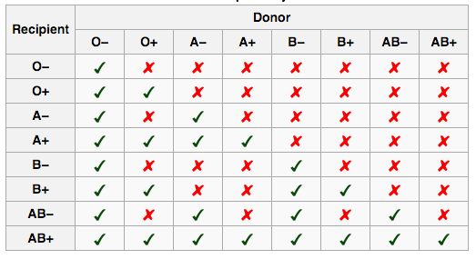

# blood-donor [![NPM version][npm-image]][npm-url] [![Build Status][travis-image]][travis-url] [![Dependency Status][daviddm-image]][daviddm-url] [![Coverage percentage][coveralls-image]][coveralls-url]
> Donors for a blood type.

## Installation

```sh
$ npm install --save blood-donor
```

## Usage

```js
var bloodDonor = require('blood-donor');

bloodDonor('B+ve', function (err, data) {
      console.log(data);
});
/* =>
{ ideal: 'B+ve',
  donors: [ 'B+ve', 'O+ve' ],
  criticalDonors: [ 'B-ve', 'O-ve' ] }
*/
```

## CLI

```sh
$ npm install --global blood-donor
```

```sh
$ blood-donor b+ve

Ideal donor: B+ve
Donors: B+ve or O+ve
Crital Donors (Rh+): B-ve or O-ve

```



## License

MIT © [Hemanth.HM](http://h3manth.com)


[npm-image]: https://badge.fury.io/js/blood-donor.svg
[npm-url]: https://npmjs.org/package/blood-donor
[travis-image]: https://travis-ci.org/hemanth/blood-donor.svg?branch=master
[travis-url]: https://travis-ci.org/hemanth/blood-donor
[daviddm-image]: https://david-dm.org/hemanth/blood-donor.svg?theme=shields.io
[daviddm-url]: https://david-dm.org/hemanth/blood-donor
[coveralls-image]: https://coveralls.io/repos/hemanth/blood-donor/badge.svg
[coveralls-url]: https://coveralls.io/r/hemanth/blood-donor
